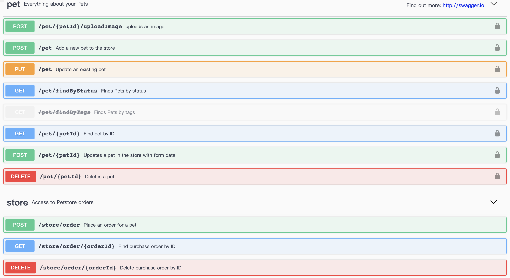

# Swagger

Swagger 是一个规范和完整的框架，用于生成、描述、调用和可视化 RESTful 风格的 Web 服务。总体目标是使客户端和文件系统作为服务器以同样的速度来更新。文件的方法，参数和模型紧密集成到服务器端的代码，允许API来始终保持同步。

 **作用：**

  *1. 接口的文档在线自动生成。*

  *2. 功能测试。*

 **Swagger是一组开源项目，其中主要项目如下：**

1. **Swagger-tools**:提供各种与Swagger进行集成和交互的工具。例如模式检验、Swagger 1.2文档转换成Swagger 2.0文档等功能。

2. **Swagger-core**: 用于Java/Scala的Swagger实现。与JAX-RS(Jersey、Resteasy、CXF...)、Servlets和Play框架进行集成。

3. **Swagger-js**: 用于JavaScript的Swagger实现。

4. **Swagger-node-express**: Swagger模块，用于node.js的Express web应用框架。

5. **Swagger-ui**：一个无依赖的HTML、JS和CSS集合，可以为Swagger兼容API动态生成优雅文档。

6. **Swagger-codegen**：一个模板驱动引擎，通过分析用户Swagger资源声明以各种语言生成客户端代码。